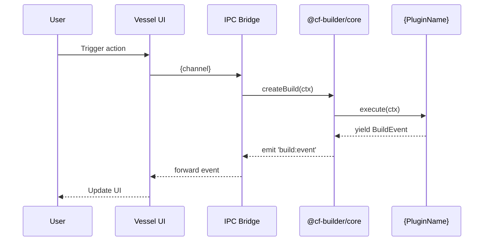

# Specification: {Feature Name}

## 1. Scope

This feature affects:
- **Core** (`packages/core`): {brief description of changes}
- **Vessel** (`apps/vessel`): {brief description of changes, or "No changes"}
- **CLI**: {brief description, or "No changes"}

> See [PRD](./prd.md) for user stories and business requirements.

---

## 2. Data Shapes

### 2.1. New Types / Interfaces

```typescript
// packages/core/src/types/index.ts or relevant file

export interface {NewType} {
  id: string;
  // ...
}
```

### 2.2. Updated BuildContext Fields

> If this feature requires new fields in BuildContext:

| Field | Type | Required | Default | Description |
|-------|------|:--------:|---------|-------------|
| {fieldName} | {type} | Yes/No | {default} | {description} |

### 2.3. New Zod Schema (if config change)

```typescript
// packages/core/src/config/schema.ts
{schemaName}: z.object({
  {field}: z.string(), // description
})
```

---

## 3. Plugin Interface Changes

> Skip if no changes to BuilderPlugin interface.

### 3.1. New Plugin (if applicable)

| Property | Type | Description |
|----------|------|-------------|
| `id` | `string` | Unique plugin ID, e.g., `'build-cache'` |
| `dependsOn` | `string[]` | Plugin IDs this must run after |
| `shouldRun(ctx)` | `boolean` | Condition for this plugin to execute |
| `execute(ctx)` | `AsyncGenerator<BuildEvent>` | Implementation |

### 3.2. New BuildEvent Types

| Event Type | Payload | Description |
|------------|---------|-------------|
| `{event-type}` | `{ pluginId: string; ... }` | When this is emitted |

---

## 4. IPC Channels (Vessel ↔ Core)

> Skip if this feature has no Vessel UI component.

### 4.1. New Channels

| Direction | Channel | Payload | Response | Description |
|-----------|---------|---------|----------|-------------|
| Renderer → Main | `{noun}:{verb}` | `{ ... }` | `{ ... }` | What it does |
| Main → Renderer | `{noun}:{event}` | `{ ... }` | — (event) | What it signals |

### 4.2. Updated Preload API (`window.api`)

```typescript
// apps/vessel/src/preload/index.ts additions
{
  {featureName}: {
    {method}: (args: {...}) => Promise<{...}>;
    on{Event}: (callback: (data: {...}) => void) => () => void; // returns unsubscribe
  }
}
```

---

## 5. CLI Changes

> Skip if no CLI changes.

### 5.1. New Flags

| Flag | Type | Default | Description |
|------|------|---------|-------------|
| `--{flag-name}` | `boolean \| string` | `{default}` | {description} |

### 5.2. Updated Help Text

```
cf-builder --app=luma --env=debug --action=publish --{new-flag}
```

---

## 6. Validation & Error Handling

| Rule | Error Code | Message |
|------|-----------|---------|
| {condition} | `{ERROR_CODE}` | {user-facing message} |

---

## 7. Sequence Diagram (if complex flow)

> Skip for simple CRUD-like features.



---

## 8. Business Rules (Technical Enforcement)

| ID | Rule | Enforced By |
|----|------|-------------|
| BR-01 | {Rule} | Core (plugin `shouldRun`) |
| BR-02 | {Rule} | Config schema (Zod validation) |
| BR-03 | {Rule} | IPC handler (input validation) |
