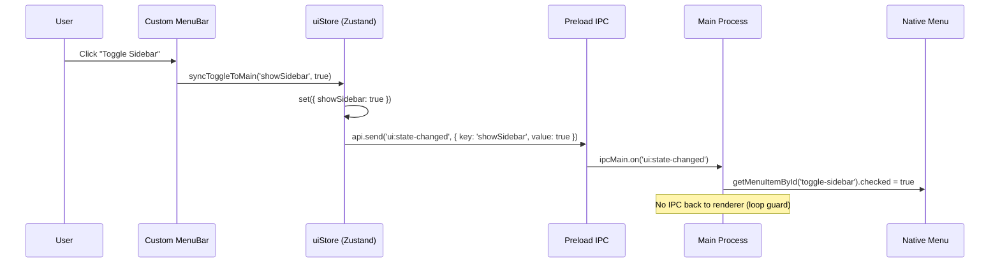
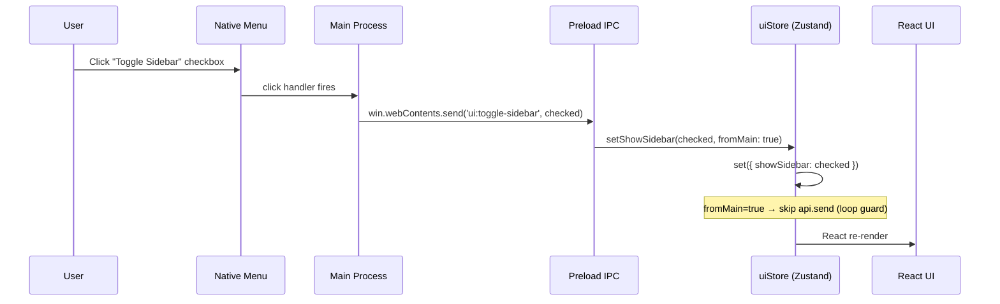
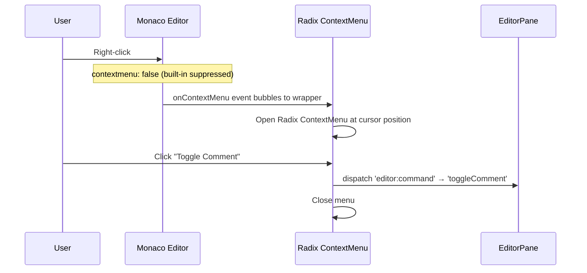

# Specification: Menu Consolidation

## 1. Scope

This feature affects:
- **Main process** (`src/main/`): Window creation flags, native menu state sync listener, auto-hide menu on Windows/Linux
- **Preload** (`src/preload/`): New IPC send channels for renderer→main state sync
- **Renderer** (`src/renderer/src/`): Platform-conditional MenuBar, new QuickStrip component, feature-parity menus, editor context menu, bidirectional sync actions

> See [PRD](./prd.md) for user stories and business requirements.

---

## 2. Data Shapes

### 2.1. UIToggleState — Shared toggle state contract

The set of toggle keys that are synced bidirectionally between main and renderer.

```typescript
/** Keys that map to native menu checkbox items and renderer UI toggles */
type UIToggleKey =
  | 'showToolbar'
  | 'showStatusBar'
  | 'showSidebar'
  | 'wordWrap'
  | 'renderWhitespace'
  | 'indentationGuides'
  | 'columnSelectMode'
  | 'splitView'

/** Payload sent from renderer to main when a toggle changes */
interface UIToggleUpdate {
  key: UIToggleKey
  value: boolean
}
```

### 2.2. Native menu item ID mapping

Each synced toggle has a stable `id` on the native menu item, used by main process to look up and update checkbox state via `Menu.getApplicationMenu().getMenuItemById(id)`.

| UIToggleKey | Native menu item `id` | Native menu label |
|-------------|----------------------|-------------------|
| `showToolbar` | `toggle-toolbar` | Toggle Toolbar |
| `showStatusBar` | `toggle-statusbar` | Toggle Status Bar |
| `showSidebar` | `toggle-sidebar` | Toggle Sidebar |
| `wordWrap` | `toggle-word-wrap` | Word Wrap |
| `renderWhitespace` | `toggle-whitespace` | Show Whitespace |
| `indentationGuides` | `toggle-indent-guides` | Show Indentation Guides |
| `columnSelectMode` | `column-select` | Column Select Mode |
| `splitView` | `toggle-split-view` | Split View |

### 2.3. MenuItem type — Custom MenuBar item shape

Extended from current `MenuItem` interface in `MenuBar.tsx`:

```typescript
interface MenuItem {
  label: string
  icon?: React.ReactNode
  shortcut?: string
  action?: () => void
  separator?: boolean
  disabled?: boolean               // NEW — grayed out, non-clickable
  checked?: boolean                // NEW — checkbox-style toggle items
  submenu?: MenuItem[]             // NEW — nested dropdown
}
```

### 2.4. EditorContextMenuItem — Context menu item shape

```typescript
interface EditorContextMenuItem {
  label: string
  icon?: React.ReactNode
  action: () => void
  shortcut?: string
  separator?: boolean
  disabled?: boolean
  submenu?: EditorContextMenuItem[]
}
```

### 2.5. Updated uiStore state

New fields and actions added to `UIState` interface:

| Field / Action | Type | Description |
|----------------|------|-------------|
| `wordWrap` | `boolean` | Whether word wrap is enabled (default: `false`) |
| `renderWhitespace` | `boolean` | Whether whitespace rendering is on (default: `false`) |
| `indentationGuides` | `boolean` | Whether indent guides are shown (default: `true`) |
| `columnSelectMode` | `boolean` | Whether column select mode is active (default: `false`) |
| `splitView` | `boolean` | Whether split view is active (default: `false`) |
| `setWordWrap` | `(v: boolean) => void` | Setter |
| `setRenderWhitespace` | `(v: boolean) => void` | Setter |
| `setIndentationGuides` | `(v: boolean) => void` | Setter |
| `setColumnSelectMode` | `(v: boolean) => void` | Setter |
| `setSplitView` | `(v: boolean) => void` | Setter |
| `syncToggleToMain` | `(key: UIToggleKey, value: boolean) => void` | Sends IPC to main and updates local state. Used by all UI-initiated toggles. |

---

## 3. IPC Channels

### 3.1. New Channels

| Direction | Channel | Payload | Response | Description |
|-----------|---------|---------|----------|-------------|
| Renderer → Main | `ui:state-changed` | `UIToggleUpdate` | — (fire-and-forget) | Renderer notifies main that a toggle changed. Main updates native menu checkbox. |

### 3.2. Existing Channels (Unchanged)

These channels continue to work as-is for **Main → Renderer** direction:

| Channel | Payload | Description |
|---------|---------|-------------|
| `ui:toggle-toolbar` | `boolean` | Native menu checkbox state |
| `ui:toggle-statusbar` | `boolean` | Native menu checkbox state |
| `ui:toggle-sidebar` | `boolean` | Native menu checkbox state |
| `ui:toggle-split-view` | `boolean` | Native menu checkbox state |
| `ui:toggle-theme` | — | Toggle theme |
| `editor:set-option` | `Record<string, unknown>` | Word wrap, whitespace, indent guides |
| `editor:command` | `string` | Editor commands (toggleColumnSelect, etc.) |

### 3.3. Updated Preload API

**`api.send` allowlist** — add one channel:

```
'ui:state-changed'
```

No changes to `api.on` or `api.invoke` — existing channels suffice.

### 3.4. Sync loop prevention

When renderer receives a toggle IPC from main (e.g., `ui:toggle-toolbar`), it must update local state **without** sending `ui:state-changed` back. The sync-back channel is only used when the change **originates** in the renderer.

Implementation contract: each setter in uiStore has an optional `fromMain?: boolean` parameter. When `true`, the setter skips the `api.send('ui:state-changed', ...)` call.

```typescript
setShowToolbar: (v: boolean, fromMain?: boolean) => void
```

---

## 4. Window Configuration Changes

### 4.1. Main process window creation (`src/main/index.ts`)

| Property | Current | New (macOS) | New (Windows/Linux) |
|----------|---------|-------------|---------------------|
| `autoHideMenuBar` | `false` | `false` | `true` |
| `titleBarStyle` | `'hiddenInset'` (macOS) / `'default'` | No change | No change |

### 4.2. Native menu item IDs (`src/main/menu.ts`)

All checkbox-type menu items must have a stable `id` property (see mapping in 2.2). Currently only `column-select`, `macro-stop`, `saved-macros`, `plugins-menu`, `language-menu`, `recent-files` have IDs. The remaining checkboxes need IDs added.

---

## 5. Component Contracts

### 5.1. QuickStrip

**Renders on:** All platforms, always visible.

**macOS behavior:**
- Separate row, height 28px
- Traffic light spacer (78px) on left
- App icon + name on left (after spacer)
- Quick icons on right: Find, Sidebar toggle, Theme toggle
- Background is drag region (`WebkitAppRegion: 'drag'`)
- Buttons are no-drag (`WebkitAppRegion: 'no-drag'`)

**Windows/Linux behavior:**
- Does NOT render as a separate component
- Quick icons are embedded in MenuBar right side (current behavior preserved)

**Props:**

```typescript
interface QuickStripProps {
  onFind: () => void
  onToggleSidebar: () => void
  onToggleTheme: () => void
}
```

### 5.2. MenuBar (updated)

**Renders on:** Windows/Linux only. Does not render when `window.api.platform === 'darwin'`.

**Top-level menus (10):**

| Menu | Approximate item count | Contains submenus |
|------|----------------------|-------------------|
| File | 11 + Recent Files submenu | No |
| Edit | 8 + Line Operations + Convert Case | Yes (2 submenus) |
| Search | 9 (incl. bookmark group) | No |
| View | 13 (incl. zoom group) | No |
| Encoding | 7 + EOL submenu | Yes (1 submenu) |
| Language | 22 | No |
| Settings | 6 | No |
| Macro | 4 | No |
| Plugins | 2+ (dynamic) | No |
| Window | 4-6 | No |
| Help | 2 | No |

**New props required:**

```typescript
interface MenuBarProps {
  // Existing
  onNew: () => void
  onOpen: () => void
  onSave: () => void
  onSaveAs: () => void
  onSaveAll: () => void
  onClose: () => void
  onCloseAll: () => void
  onFind: () => void
  onReplace: () => void
  onFindInFiles: () => void
  onReload: () => void
  // New
  onOpenFolder: () => void
}
```

Menu items that dispatch editor commands or toggle UI state do so internally via `window.dispatchEvent`, `useUIStore`, or `window.api.send` — no additional props needed for those.

### 5.3. EditorContextMenu

**Renders on:** All platforms, inside EditorPane.

**Trigger:** Right-click in Monaco editor area. Monaco's built-in context menu must be suppressed via editor option `contextmenu: false`.

**Menu structure:**

```
Cut                    Ctrl+X
Copy                   Ctrl+C
Paste                  Ctrl+V
─────────────────────────────
Select All             Ctrl+A
─────────────────────────────
Go to Line...          Ctrl+G
Toggle Comment         Ctrl+/
Convert Case         ►
  UPPERCASE            Ctrl+Shift+U
  lowercase            Ctrl+U
  Title Case
```

**Implementation:** Radix UI `<ContextMenu>` wrapping the editor container div. Uses the same component primitives as `src/renderer/src/components/ui/context-menu.tsx`.

---

## 6. Disabled Menu Items

Items for unimplemented features render with `disabled: true` in both native menu and custom MenuBar.

| Menu | Disabled items |
|------|---------------|
| Search | Toggle Bookmark, Next Bookmark, Previous Bookmark, Clear All Bookmarks |
| View | Split View |
| Settings | Shortcut Mapper, UDL Editor, Style Configurator |
| Macro | Start Recording, Stop Recording, Playback, Saved Macros |
| Plugins | Plugin Manager |

In native menu: `{ enabled: false }` property.
In custom MenuBar: `{ disabled: true }` in MenuItem data, rendered with `opacity-40 pointer-events-none` styling.

---

## 7. Sequence Diagrams

### 7.1. Toggle from renderer (custom MenuBar or Toolbar)



### 7.2. Toggle from native menu (macOS)



### 7.3. Editor context menu



---

## 8. Business Rules (Technical Enforcement)

| ID | Rule | Enforced By |
|----|------|-------------|
| BR-001 | Platform determines menu authority | `window.api.platform` check in MenuBar render; `autoHideMenuBar` flag in main process |
| BR-002 | Single shortcut registration | On macOS: native accelerators handle shortcuts (no custom key listeners for menu items). On Windows/Linux with auto-hide: native accelerators still fire but menu is hidden; custom MenuBar shows shortcut labels only as hints, does not register global key handlers (native menu handles it). |
| BR-003 | Toggle state consistency | `syncToggleToMain()` in uiStore sends every renderer-originated change to main; main process IPC listener updates native menu checkbox. |
| BR-004 | No sync loops | `fromMain` parameter on setters; `syncToggleToMain` only called when `fromMain` is falsy. |
| BR-005 | Drag region preservation | QuickStrip background: `WebkitAppRegion: 'drag'`. Interactive children: `WebkitAppRegion: 'no-drag'`. Validated by CSS inspection. |
| BR-006 | Disabled items visible | `disabled: true` in custom MenuBar data; `enabled: false` in native menu template. No items hidden for stubbed features. |

---

## 9. Files to Modify

| File | Change type | Description |
|------|-------------|-------------|
| `src/main/index.ts` | Modify | Set `autoHideMenuBar: true` on Windows/Linux; register `ui:state-changed` IPC listener |
| `src/main/menu.ts` | Modify | Add stable `id` to all checkbox items; add `enabled: false` for stubbed items |
| `src/preload/index.ts` | Modify | Add `'ui:state-changed'` to `api.send` allowlist |
| `src/renderer/src/store/uiStore.ts` | Modify | Add editor option toggles, `fromMain` parameter, `syncToggleToMain` action |
| `src/renderer/src/components/editor/MenuBar.tsx` | Modify | Platform guard, full 10-menu structure, disabled items, submenu support |
| `src/renderer/src/components/editor/QuickStrip.tsx` | **New** | macOS-only quick strip component |
| `src/renderer/src/components/EditorPane/EditorPane.tsx` | Modify | Suppress Monaco context menu, wrap with Radix ContextMenu |
| `src/renderer/src/App.tsx` | Modify | Conditional MenuBar/QuickStrip render, wire `fromMain` on IPC handlers, pass `onOpenFolder` |
