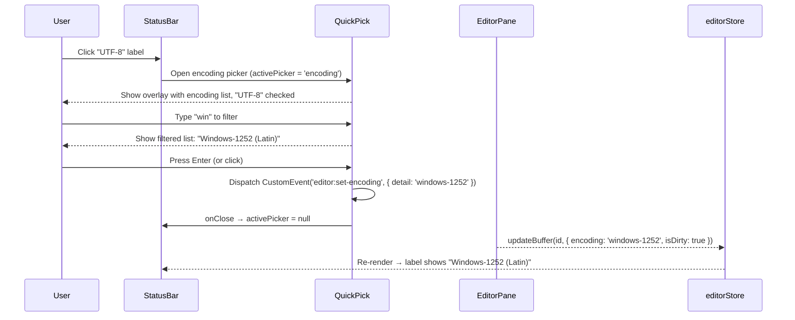

# Specification: Status Bar Selectors (Encoding, Language, EOL)

## 1. Scope

This feature affects:
- **Main process** (`src/main/menu.ts`): Remove Encoding and Language top-level menus from the native Electron menu.
- **Renderer** (`src/renderer/src/`): New QuickPick component, updated StatusBar, updated MenuBar (remove Encoding/Language sections), new value mapping constants.
- **Preload** (`src/preload/index.ts`): No changes — existing IPC channels and `CustomEvent` dispatch are sufficient.

> See [PRD](./prd.md) for user stories and business requirements.

---

## 2. Data Shapes

### 2.1. Encoding Registry

A canonical mapping between internal encoding values (used in store, dispatched in events, passed to `iconv-lite`) and display labels shown in the Quick Pick and Status Bar.

```typescript
interface EncodingEntry {
  value: string    // internal value stored in Buffer.encoding, passed to iconv-lite
  label: string    // display name shown in Quick Pick list and Status Bar
}
```

**Canonical encoding list:**

| `value` | `label` | Notes |
|---------|---------|-------|
| `UTF-8` | `UTF-8` | Default. Matches `chardet` output. |
| `UTF-8 BOM` | `UTF-8 with BOM` | |
| `UTF-16 LE` | `UTF-16 LE` | |
| `UTF-16 BE` | `UTF-16 BE` | |
| `windows-1252` | `Windows-1252 (Latin)` | `chardet` returns `'windows-1252'`; `iconv-lite` accepts this. |
| `ISO-8859-1` | `ISO-8859-1 (Latin-1)` | |

**Note — existing inconsistency:** The native menu currently dispatches short aliases (`utf8`, `utf8bom`, `win1252`, `iso88591`) while `chardet` and the status bar cycle use full names (`UTF-8`, `UTF-8 BOM`). The Quick Pick must normalize to the `value` column above, which aligns with `chardet` output and `iconv-lite` accepted names. The `CustomEvent` detail dispatched by the Quick Pick must use the `value` column.

### 2.2. Language Registry

A canonical mapping between Monaco language IDs and display labels.

```typescript
interface LanguageEntry {
  value: string    // Monaco language ID stored in Buffer.language
  label: string    // display name shown in Quick Pick list and Status Bar
}
```

**Canonical language list:**

| `value` | `label` |
|---------|---------|
| `auto` | `Auto Detect` |
| `plaintext` | `Plain Text` |
| `javascript` | `JavaScript` |
| `typescript` | `TypeScript` |
| `python` | `Python` |
| `cpp` | `C++` |
| `c` | `C` |
| `csharp` | `C#` |
| `java` | `Java` |
| `go` | `Go` |
| `rust` | `Rust` |
| `html` | `HTML` |
| `css` | `CSS` |
| `json` | `JSON` |
| `xml` | `XML` |
| `markdown` | `Markdown` |
| `sql` | `SQL` |
| `shell` | `Shell Script` |
| `powershell` | `PowerShell` |
| `yaml` | `YAML` |
| `php` | `PHP` |
| `ruby` | `Ruby` |

### 2.3. EOL Registry

```typescript
interface EOLEntry {
  value: EOLType   // 'LF' | 'CRLF' | 'CR' — stored in Buffer.eol
  label: string    // display name in Quick Pick list
  short: string    // short form shown in Status Bar
}
```

| `value` | `label` | `short` |
|---------|---------|---------|
| `LF` | `LF (Unix)` | `LF` |
| `CRLF` | `CRLF (Windows)` | `CRLF` |
| `CR` | `CR (Classic Mac)` | `CR` |

### 2.4. QuickPick Props

The QuickPick is a generic, reusable component. Its contract:

```typescript
interface QuickPickItem {
  value: string       // opaque value returned on selection
  label: string       // primary display text
  description?: string // secondary text (e.g., encoding description)
}

interface QuickPickProps {
  items: QuickPickItem[]
  activeValue: string | null      // currently selected value (shows checkmark)
  placeholder?: string            // search input placeholder text
  onSelect: (value: string) => void  // called when user picks an item
  onClose: () => void             // called when dismissed without selection
}
```

### 2.5. QuickPick State

The Quick Pick open/close state is managed locally in StatusBar via React `useState` — not in Zustand. Rationale: this is transient UI state with no cross-component consumers.

```typescript
type ActivePicker = 'encoding' | 'language' | 'eol' | null
```

Only one picker can be open at a time. Setting a new `ActivePicker` implicitly closes the previous one.

---

## 3. Event Contracts

No new IPC channels or `CustomEvent` types are introduced. The Quick Pick dispatches the same events the existing menus and status bar cycle use:

### 3.1. Encoding Selection

```typescript
// Quick Pick dispatches:
window.dispatchEvent(new CustomEvent('editor:set-encoding', { detail: value }))
// where `value` is from the EncodingEntry.value column (e.g., 'UTF-8', 'windows-1252')
```

**Consumer:** `EditorPane.tsx` effect — `applyEncoding(encoding)` → `updateBuffer(id, { encoding, isDirty: true })`

### 3.2. Language Selection

```typescript
// Quick Pick dispatches:
window.dispatchEvent(new CustomEvent('editor:set-language-local', { detail: value }))
// where `value` is from the LanguageEntry.value column (e.g., 'javascript', 'auto')
```

**Consumer:** `EditorPane.tsx` effect — `applyLanguage(lang)` → `monaco.editor.setModelLanguage(model, lang)` + `updateBuffer(id, { language })`

### 3.3. EOL Selection

```typescript
// Quick Pick dispatches:
window.dispatchEvent(new CustomEvent('editor:set-eol', { detail: value }))
// where `value` is from the EOLEntry.value column (e.g., 'LF', 'CRLF', 'CR')
```

**Consumer:** `EditorPane.tsx` effect — `applyEol(eol)` → `model.setEOL(monacoEol)` + `updateBuffer(id, { eol })`

---

## 4. Component Contracts

### 4.1. QuickPick Component

| Aspect | Contract |
|--------|----------|
| **Rendering** | React Portal, appended to `document.body` |
| **Position** | Centered horizontally, anchored ~60px from top of viewport (below tab bar area) |
| **Width** | Fixed width: `min(400px, 90vw)` |
| **Max height** | List scrolls at ~300px; total overlay does not exceed 360px |
| **Backdrop** | Semi-transparent overlay (`bg-black/30`) covering entire viewport; click to dismiss |
| **Search input** | Always rendered; auto-focused on mount; filters list in real time |
| **Filter logic** | Case-insensitive substring match on `item.label` |
| **Active item** | Item matching `activeValue` renders with a checkmark icon on the left |
| **Highlighted item** | Keyboard-navigable highlight; first matching item highlighted by default |
| **Keyboard** | `ArrowUp`/`ArrowDown` move highlight; `Enter` selects; `Escape` closes |
| **Animation** | Fade-in on mount (~100ms, `opacity 0→1`) |
| **Theme** | Uses existing Tailwind theme tokens: `bg-popover`, `text-popover-foreground`, `border` |
| **Z-index** | Above all app content (`z-50`) |

### 4.2. StatusBar Item Updates

Each of the three status bar items (EOL, Encoding, Language) must:

| Aspect | Contract |
|--------|----------|
| **Display** | Show human-readable label from the registry (not internal value) |
| **Hover** | `hover:bg-statusbar-hover` background + cursor pointer |
| **Click** | Opens the corresponding QuickPick (sets `activePicker` state) |
| **No buffer** | Items still render with defaults (`LF`, `UTF-8`, `Plain Text`) but clicks are no-ops |

### 4.3. StatusBar Display Name Resolution

The Status Bar must resolve internal values to display labels:

- **Encoding:** `Buffer.encoding` → `EncodingEntry.label` via registry lookup. If not found in registry, display the raw value as-is (handles `chardet` returning unusual encoding names).
- **Language:** `Buffer.language` → `LanguageEntry.label` via registry lookup. If not found, title-case the raw value.
- **EOL:** `Buffer.eol` → `EOLEntry.short` via registry lookup. Always found (only 3 values).

---

## 5. Removals

### 5.1. Native Menu (`src/main/menu.ts`)

Remove these two top-level menu entries from the `template` array:

| Menu | Lines (approx) | Content |
|------|-----------------|---------|
| `Encoding` | Section starting `label: 'E&ncoding'` | 6 encoding items + EOL submenu |
| `Language` | Section starting `label: '&Language'` | Auto Detect + Plain Text + 20 languages |

The remaining top-level menus after removal: App (macOS), File, Edit, Search, View, Settings, Macro, Plugins, Window, Help.

### 5.2. Custom MenuBar (`src/renderer/src/components/editor/MenuBar.tsx`)

Remove these keys from the `menus` object:

| Key | Content |
|-----|---------|
| `Encoding` | 6 encoding items + EOL submenu |
| `Language` | Auto Detect + Plain Text + 20 language items |

### 5.3. Preload Allowlist (`src/preload/index.ts`)

The IPC channels `editor:set-encoding`, `editor:set-eol`, and `editor:set-language` remain in the allowlist. They are still used by the EditorPane event handlers (which listen on both IPC and CustomEvent). No channels are removed.

### 5.4. StatusBar Cycle Logic

Remove the `cycleEOL` and `cycleEncoding` callbacks from `StatusBar.tsx`. These are replaced by the QuickPick interaction. The `ENCODING_CYCLE` and `EOL_CYCLE` constants are also removed.

---

## 6. Validation & Error Handling

| Rule | Handling |
|------|----------|
| User clicks status bar item with no active buffer | No picker opens; click is a no-op |
| User selects encoding not recognized by `iconv-lite` | Not possible — picker only offers values from the canonical registry |
| Search input matches no items | Empty list with "No matching items" placeholder text |
| Quick Pick is open and user switches tabs | Picker closes (listens for `activeId` change in `editorStore`) |

---

## 7. Sequence Diagram



---

## 8. Business Rules (Technical Enforcement)

| ID | Rule | Enforced By |
|----|------|-------------|
| BR-001 | Status bar is the sole selector for encoding, language, EOL | Removal of menu entries in `menu.ts` and `MenuBar.tsx` |
| BR-002 | One picker open at a time | `activePicker` state: setting a new value implicitly nulls the previous |
| BR-003 | Picker requires active buffer | StatusBar click handler checks `getActive() !== null` before setting `activePicker` |
| BR-004 | Existing event contracts preserved | QuickPick dispatches identical `CustomEvent` types and value formats as existing handlers expect |
| BR-005 | Display names resolved from registry | StatusBar and QuickPick both use the same registry constants; raw internal values are never shown to the user (except unknown chardet results as fallback) |
| BR-006 | Picker closes on tab switch | StatusBar `useEffect` watches `activeId` and resets `activePicker` to `null` on change |
