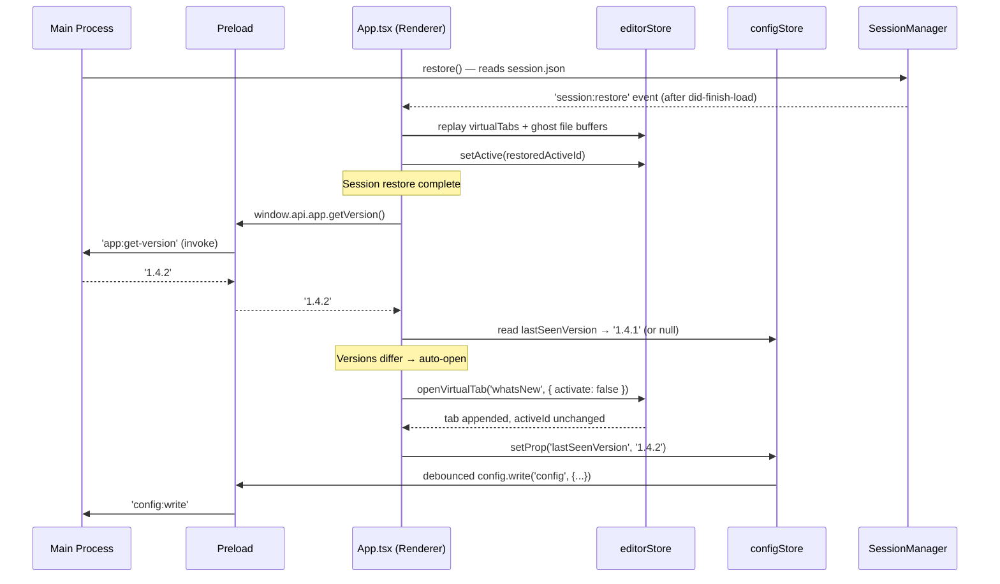
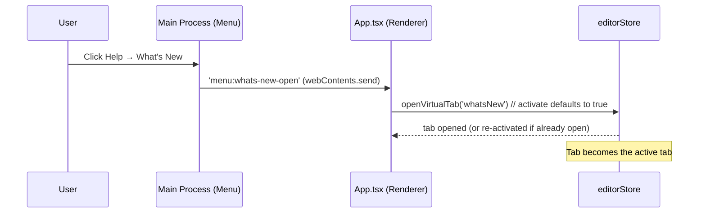

# Specification: What's New Tab

## 1. Scope

This feature affects:
- **Main** (`src/main/`): Help submenu gains a new entry; new IPC handler exposes `app.getVersion()`. No file I/O, no main-side config logic.
- **Preload** (`src/preload/`): IPC allow-list extended with one new channel; `window.api.app.getVersion()` added.
- **Renderer** (`src/renderer/`): New `'whatsNew'` virtual-tab kind; new `WhatsNewTab` component; `openVirtualTab` gains an options bag for background open; `configStore` gains `lastSeenVersion`; `App.tsx` runs the version-comparison after session restore and wires the manual-open IPC.
- **Session persistence** (`src/main/sessions/SessionManager.ts`): `SessionVirtualKind` union extended.

> See [PRD](./prd.md) for user stories and business requirements.

---

## 2. Data Shapes

### 2.1. Updated Type — `BufferKind`

`src/renderer/src/store/editorStore.ts`

```typescript
// Before
export type BufferKind = 'file' | 'settings' | 'shortcuts'

// After
export type BufferKind = 'file' | 'settings' | 'shortcuts' | 'whatsNew'
```

The `Buffer` interface itself does not change — `kind` remains the discriminator.

### 2.2. Updated Type — `SessionVirtualKind`

`src/main/sessions/SessionManager.ts`

```typescript
// Before
export type SessionVirtualKind = 'settings' | 'shortcuts'

// After
export type SessionVirtualKind = 'settings' | 'shortcuts' | 'whatsNew'
```

`KNOWN_VIRTUAL_KINDS` set must include `'whatsNew'` so `whatsNew` virtual tabs round-trip through `session.json` instead of being silently dropped during normalization.

The matching renderer-side type in `src/renderer/src/hooks/useFileOps.ts` (`SessionData.virtualTabs[].kind`) must be widened in lockstep.

### 2.3. Updated `openVirtualTab` Signature

`src/renderer/src/store/editorStore.ts`

```typescript
// Before
openVirtualTab: (kind: 'settings' | 'shortcuts') => string

// After
openVirtualTab: (
  kind: 'settings' | 'shortcuts' | 'whatsNew',
  options?: { activate?: boolean }
) => string
```

| Option | Type | Default | Behavior |
|--------|------|:-------:|----------|
| `activate` | `boolean` | `true` | When `true` (default), the opened/found tab becomes the active tab — preserves all existing call-sites. When `false`, the tab is appended (or left in place if already exists) and `activeId` is **not** changed. |

Backwards compatibility: every existing caller (`SettingsMenu.tsx:44/49`, `SideNav.tsx:35`, `App.tsx:113-114`, `useFileOps.ts:155`) continues to work unchanged because `activate` defaults to `true`.

### 2.4. Updated `AppConfig`

`src/renderer/src/store/configStore.ts`

| Field | Type | Required | Default | Description |
|-------|------|:--------:|---------|-------------|
| `lastSeenVersion` | `string \| null` | No | `null` | The app version string (`app.getVersion()` value) for which the user was last shown the auto-open. `null` means "never seen" — treated as a version mismatch on next launch. |

`CONFIG_DEFAULTS.lastSeenVersion = null`. Existing config files on disk that lack this field load as `null` via the standard merge-with-defaults path — no migration needed.

### 2.5. Virtual-Buffer Title Map

The literal map inside `openVirtualTab` (currently `kind === 'settings' ? 'Settings' : 'Keyboard Shortcuts'`) must add the `'whatsNew' → "What's New"` branch. Title is static (never version-stamped).

---

## 3. Plugin Interface Changes

Not applicable — this feature does not touch the plugin system.

---

## 4. IPC Channels

### 4.1. New Channels

| Direction | Channel | Payload | Response | Description |
|-----------|---------|---------|----------|-------------|
| Main → Renderer | `menu:whats-new-open` | `—` (no args) | — (event) | Fired by the Help menu click. Renderer opens the `'whatsNew'` virtual tab with `activate: true` (foreground). |
| Renderer → Main (invoke) | `app:get-version` | `—` | `string` | Returns `app.getVersion()`. Renderer uses this for the version-mismatch comparison after session restore. |

### 4.2. Updated Preload API (`window.api`)

`src/preload/index.ts` additions:

```typescript
{
  // ...existing...
  app: {
    getVersion: () => Promise<string>;  // backed by 'app:get-version' invoke
  }

  // 'menu:whats-new-open' added to the on() / off() allow-lists
}
```

Notes:
- The existing `window.api.appVersion` constant (`process.env['npm_package_version'] ?? '1.0.0'`) is **unreliable in packaged builds** — env vars set by `npm run` aren't present when Electron launches the bundled binary. Callers needing a correct version string must use the new `window.api.app.getVersion()` invoke. The legacy constant is left in place to avoid scope creep but should be considered deprecated; this feature must not depend on it.
- No new Renderer → Main `send` channels are needed. The auto-open path is entirely renderer-internal: after session restore completes, `App.tsx` compares versions and calls `openVirtualTab('whatsNew', { activate: false })` directly.
- The persistence of `lastSeenVersion` reuses the existing debounced `configStore.save()` path (which writes through `window.api.config.write('config', ...)`). No new config channel needed.

---

## 5. CLI Changes

Not applicable — NovaPad has no CLI surface.

---

## 6. Validation & Error Handling

| Rule | Failure Mode | Behavior |
|------|--------------|----------|
| `app:get-version` rejects (e.g., IPC down) | Promise rejection in renderer | Log a `console.warn`, skip the auto-open this launch. **Do not** write `lastSeenVersion`. Manual open via Help menu still works. |
| `lastSeenVersion` config write fails | `configStore.save()` exception | Log a `console.warn`. The auto-open will fire again on next launch (correct fail-safe — user sees the tab again rather than missing it forever). |
| `lastSeenVersion` value in config is malformed (non-string, non-null) | Invariant violation | Treat as `null` (i.e., trigger auto-open). The standard config-defaults merge already coerces missing/wrong-typed fields. |
| Session restore not completing (no `session:restore` event ever fires) | Auto-open never triggers | Acceptable — manual Help menu path is unaffected. The auto-open is a convenience, not a correctness requirement. |

No user-facing error codes or toasts. All failure modes are silent (log-only) because the user has not requested the auto-open explicitly — surfacing errors would be noisier than the value of the feature.

---

## 7. Sequence Diagrams

### 7.1. Auto-open after version change



### 7.2. Manual open from Help menu



---

## 8. Business Rules (Technical Enforcement)

| ID | Rule (from PRD) | Enforced By |
|----|-----------------|-------------|
| BR-001 | At-most-once auto-open per (user, version) | `App.tsx` writes `lastSeenVersion = currentVersion` immediately after the auto-open IPC dispatch, before any user interaction. |
| BR-002 | Auto-open never steals focus | `openVirtualTab(kind, { activate: false })` does not mutate `activeId` in `editorStore`. The default `activate: true` is used only by manual entry points. |
| BR-003 | String-equality version compare; null counts as "different" | `App.tsx`: `if (lastSeenVersion !== currentVersion) { ... }`. No semver parsing; `null !== '1.4.2'` is true. |
| BR-004 | Write-on-fire, not write-on-close | `App.tsx` calls `configStore.setProp('lastSeenVersion', currentVersion)` in the same code block that calls `openVirtualTab(...)` — no dependency on tab close events. |
| BR-005 | Auto-open waits for renderer ready | The version-comparison logic is invoked from inside the existing `'session:restore'` handler in `App.tsx`, which is itself only fired after `did-finish-load` (per `SessionManager.restore()`). For users with no prior session, the same logic is invoked from a fallback "session restore complete with no data" branch (post-mount effect that runs once). |
| BR-006 | Virtual-tab dedupe | Inherited unchanged from existing `openVirtualTab` logic: the function looks up an existing buffer with the same `kind` first and re-activates it (or, with `activate: false`, leaves it untouched but does not duplicate). |

---

## 9. Open Implementation Notes (non-contract, for the planner)

These are not part of the contract but the planner should be aware:

- **Where to render `WhatsNewTab`**: virtual tabs are currently rendered by whichever component switches on `buffer.kind` for non-`'file'` buffers (see how `SettingsTab` is mounted). The new component slots into that same switch — no new routing infrastructure.
- **No-prior-session case**: `SessionManager.restore()` only sends `session:restore` if a session file exists. Renderer needs a "session-restore-finished-or-skipped" signal so the auto-open trigger fires for fresh-install users too. Suggested approach: `App.tsx` runs the version check from a `useEffect` that depends on `configStore.loaded` (so it waits for config to hydrate) and runs once. The session-restore handler can early-out on this same effect or set a flag.
- **`window.api.appVersion` cleanup**: out of scope, but worth a follow-up — its current implementation is a foot-gun in production builds.
